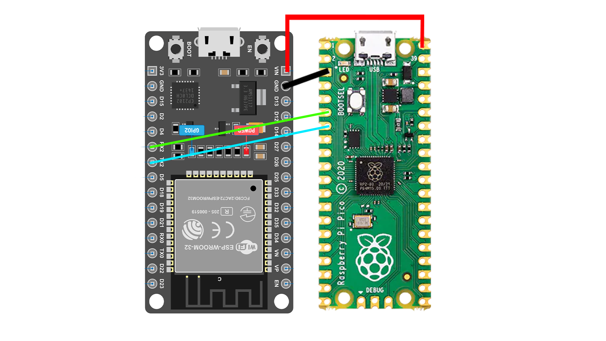

# KaosDual Extended

## 1. Project title and summary

KaosDual Extended is an extended community fork of [KaosDual](https://github.com/minecraftGman/KaosDual), focused on simple hardware, an integrated Skylander library, four-slot support, and safe save inspection/editing. It is not an official, definitive, or replacement version of KaosDual.

Upstream KaosDual is credited to [minecraftGman](https://github.com/minecraftGman). It is based on the original [KAOS project](https://github.com/NicoAICP/KAOS). See [CREDITS.md](CREDITS.md) for detail.

The design uses a Raspberry Pi Pico as the USB portal emulator and an ESP32 as the Wi-Fi WebUI, library store, and bridge. No SD card is required. You must supply your own authorised `.sky` dumps; none are included here.

Detailed beginner guides are in [docs](docs/01%20Hardware%20Needed.md).

## 2. Features

- Four independent portal slots (P1–P4).
- ESP32 + Pico portal architecture, responsive phone-friendly WebUI, and no SD card requirement.
- Indexed built-in library with client-side search, sorting, game/element/type navigation, favourites, and a separate User Added section.
- Upload, raw download, loaded-file protection, and safe delete controls.
- Working portal save/writeback.
- Encrypted/plaintext save inspection plus Gold and Level inspection/editing for validated normal progression-bearing figures.
- Checksum validation, temporary-file verification, one-file backup, and restore.
- Library recognition/load support for traps, vehicles, Creation Crystals, Sidekicks, Items, and Adventure Packs.

Editing is deliberately narrow: Traps, Vehicles, Creation Crystals, Items, Adventure Packs, unsupported formats, and unsupported Swap Force bottom halves are not editable.

## 3. Required hardware

- An **ESP32 DevKit V1-class ESP32 board with 4 MB flash** (the supplied partition table targets a 4 MB ESP32).
- A Raspberry Pi Pico. The repository also has a local board definition for Waveshare RP2040-Zero.
- four jumper wires for UART, ground and 5v.
- Suitable data-capable USB cables: one for the ESP32 and one for the Pico/console or PC.
- A Windows PC for the steps below.
- Optional: a PCF8574 LCD1602 I²C display. It is not required to use the WebUI.



See [Hardware Needed](docs/01%20Hardware%20Needed.md) and [Wiring](docs/02%20Wiring.md). UART is 3.3 V logic: do not connect either UART pin to a 5 V TTL signal, and always connect the boards’ grounds.

## 4. Required software

- [Git for Windows](https://git-scm.com/download/win).
- [ESP-IDF for Windows](https://docs.espressif.com/projects/esp-idf/en/latest/esp32/get-started/windows-setup.html), including its supplied Python, CMake, and Ninja tools.
- [Raspberry Pi Pico SDK](https://github.com/raspberrypi/pico-sdk) and its ARM build toolchain.
- [CMake](https://cmake.org/download/) and [Ninja](https://ninja-build.org/) if they were not installed with your chosen toolchain.

Links and setup notes are collected in [Useful Software Links](docs/Useful%20Software%20Links.md).

## 5. Repository download

**Git:**

```powershell
git clone https://github.com/galaxy2685/KaosDual.git KaosDual-Extended
cd KaosDual-Extended
```

Or use GitHub’s **Code → Download ZIP**, extract it, and open the extracted folder. The important layout is:

```text
KaosDual-Extended/
  esp32/                 ESP-IDF project
  pico/                  Pico SDK project
  kaos_protocol.h        shared protocol definition
  docs/                  beginner guides
```

## 6. Build and flash the Pico

Install the Pico SDK/toolchain first. Open PowerShell in the repository and set `PICO_SDK_PATH` to your SDK folder for that PowerShell session:

```powershell
cd "C:\path\to\KaosDual-Extended\pico"
$env:PICO_SDK_PATH = "C:\path\to\pico-sdk"
cmake -S . -B build -G Ninja -DPICO_BOARD=pico -DCMAKE_BUILD_TYPE=Release
cmake --build build
```

The output is `pico\build\kaos_pico.uf2`. Hold **BOOTSEL** while connecting the Pico to the PC. It appears as `RPI-RP2`; copy the UF2 onto that drive, wait for the automatic reboot, then reconnect it normally. The repository does not ship a prebuilt UF2. For Waveshare RP2040-Zero use `-DPICO_BOARD=waveshare_rp2040_zero`; see [Flashing the Pico](docs/03%20Flashing%20the%20Pico.md).

## 7. Build and flash the ESP32

Open an **ESP-IDF PowerShell** so `idf.py` is available:

```powershell
cd "C:\path\to\KaosDual-Extended\esp32"
idf.py reconfigure
idf.py build
idf.py -p COM3 flash
```

Replace `COM3` with the ESP32’s port from Windows Device Manager. A first install, or a change to `esp32\skylandersDumps`, needs full `flash` because it writes SPIFFS. `idf.py -p COM3 app-flash` writes only the application and preserves SPIFFS runtime saves, uploads, favourites, and deletions. A full flash replaces SPIFFS; back up important saves first.

## 8. Providing `.sky` files

**This repository includes no Skylander dump files.** Provide only dumps created from figures you own or are otherwise authorised to use. A supported dump is normally exactly **1,024 bytes**.

Put files under `esp32\skylandersDumps` before a full ESP32 flash. Folder names are metadata, not file contents:

```text
Spyros Adventure\Magic\Spyro.sky
Giants\Giants\Tree Rex.sky
Trap Team\Dark\Blackout.sky
Trap Team\Traps\Magic\Magic Trap.sky
Superchargers\Water\Vehicles\Reef Ripper.sky
Imaginators\Creation Crystals\Fire Crystal.sky
Items\Trap Team\Item.sky
Adventure Packs\Spyros Adventure\Pack.sky
Sidekicks\Giants\Sidekick.sky
```

`Alternative Types` is recognised anywhere beneath a game grouping. Images and non-`.sky` files are ignored and are never packaged into SPIFFS. Swap Force progression editing operates on the top-half dump; bottom halves are not supported for normal Gold/Level editing. More examples: [Adding Skylander Dumps](docs/06%20Adding%20Skylander%20Dumps.md).

## 9. First boot

1. Connect the ESP32 and Pico as in [Wiring](docs/02%20Wiring.md), then power both boards.
2. Connect your phone/PC to Wi-Fi **`KAOS-Portal`** with password **`skylands1`** (change these in `esp32/main/main.c` if desired before building).
3. Browse to [http://192.168.4.1](http://192.168.4.1).
4. Wait for library metadata to load. If it says **Library unavailable**, use **Rebuild Library**.
5. Confirm the library entry count. An empty library is valid until you add authorised dumps and full-flash SPIFFS, or upload files through User Added.

## 10. Using the WebUI

Use a library card’s **Load P1**, **Load P2**, **Load P3**, or **Load P4** action. The four player cards show the loaded files and provide unloading. Search is case-insensitive and works with game, element, type, category, and sorting controls. The six game buttons and generated element/type buttons avoid exact-name typing.

Use **Favourites** to bookmark metadata entries. **User Added** is the only upload route. Download returns the raw stored 1,024-byte dump. Delete is intentionally blocked while a file is loaded. Rebuild Library rescans metadata, not dump contents. See [Using the WebUI](docs/07%20Using%20the%20WebUI.md).

## 11. Gold and Level editor

Open **Inspect** on a supported unloaded normal character. The inspector validates its encrypted/plaintext representation, identifies the active save area, and displays Gold, Level, counters, and validity. Save only accepts valid values; it changes the selected field, recalculates the required checksum(s), encrypts where required, verifies a temporary file by reopening it, then keeps one `.bak` backup. Restore Backup is shown only when one exists.

The game alternates two save areas, keeping the older area as a fallback. Real-game testing indicates a gameplay Gold cap of **65,000**, though its unsigned storage field can represent 65,535. Loading, editing, restoring, replacing, and deleting are blocked where needed for loaded files. Traps, Vehicles, Creation Crystals, Items, Adventure Packs, unsupported formats, and unsupported figure types remain editor-disabled. Details: [Save Editor](docs/08%20Save%20Editor.md).

## 12. Backups and data safety

Each editor save replaces the previous single `.bak` backup for that file; it does not create an unlimited chain. Use raw download before important changes. `app-flash` preserves SPIFFS, while full `flash` writes the packaged SPIFFS image and can replace runtime saves, User Added files, favourites, and deletions. Packaged library files can return after a full flash.

## 13. Troubleshooting

- **ESP32 is not listed:** use a data cable, install the board’s USB-serial driver if required, and check Device Manager.
- **Wrong COM port:** unplug/replug, then compare Device Manager’s Ports list.
- **Pico is not RPI-RP2:** unplug it, hold BOOTSEL, then reconnect directly to the PC with a data cable.
- **Ninja/build lock:** close terminals using the build folder, then run `idf.py fullclean` (ESP32) or remove only that project’s `pico\build` folder before configuring again.
- **WebUI does not load:** join `KAOS-Portal`, turn off mobile data temporarily if the phone refuses the local portal, and open `http://192.168.4.1`.
- **Library unavailable/empty:** use Rebuild Library; check that source dump paths are under `esp32\skylandersDumps`, files end in `.sky`, and full-flash after changing the packaged library.
- **Wrong-size file:** valid portal dumps must be 1,024 bytes.
- **Editor unavailable or file cannot be deleted:** the figure may be unsupported or currently loaded; unload it first.
- **Data vanished after full flash:** full flash writes SPIFFS. Restore from a raw download/backup.

See the fuller [Troubleshooting guide](docs/09%20Troubleshooting.md).

## 14. Building without `.sky` files

Yes: the public repository deliberately has an empty library and builds without dumps. CMake creates an empty SPIFFS staging directory and copies only discovered `.sky` files; `.gitkeep`, images, and other assets are excluded. Do not add a fabricated dump merely to build.

## 15. Credits and licensing

Upstream notices and attribution are retained in [CREDITS.md](CREDITS.md). No project licence file was present in the verified source snapshot, so this fork does not assert a new licence or make a compatibility conclusion. `sky_editor.c` includes an independently reproduced format implementation informed by SkyEditGUI analysis; **TODO:** confirm derivative-work status before adding a licence claim. SkyEditGUI is GPLv3, and any copied or closely adapted code would require careful licensing review.

## 16. Release status

| Area | Status |
|---|---|
| Portal load/save | Supported |
| Four slots | Supported |
| Built-in/User Added library | Supported |
| Gold editor | Supported for validated normal characters |
| Level editor | Supported for validated normal characters |
| Traps | Library/load supported; editor unsupported |
| Vehicles | Library/load supported; editor unsupported |
| Creation Crystals | Library/load supported; editor unsupported |
| Images in SPIFFS | Not included |
| SD card | Not required |

## Detailed guides

- [Hardware Needed](docs/01%20Hardware%20Needed.md)
- [Wiring](docs/02%20Wiring.md)
- [Flashing the Pico](docs/03%20Flashing%20the%20Pico.md)
- [Flashing the ESP32](docs/04%20Flashing%20the%20ESP32.md)
- [First Boot](docs/05%20First%20Boot.md)
- [Adding Skylander Dumps](docs/06%20Adding%20Skylander%20Dumps.md)
- [Using the WebUI](docs/07%20Using%20the%20WebUI.md)
- [Save Editor](docs/08%20Save%20Editor.md)
- [Troubleshooting](docs/09%20Troubleshooting.md)
- [Useful Software Links](docs/Useful%20Software%20Links.md)
